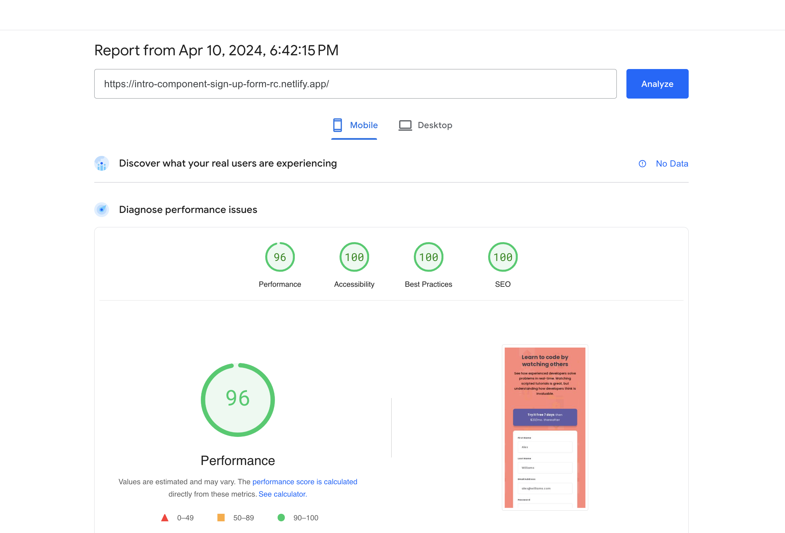
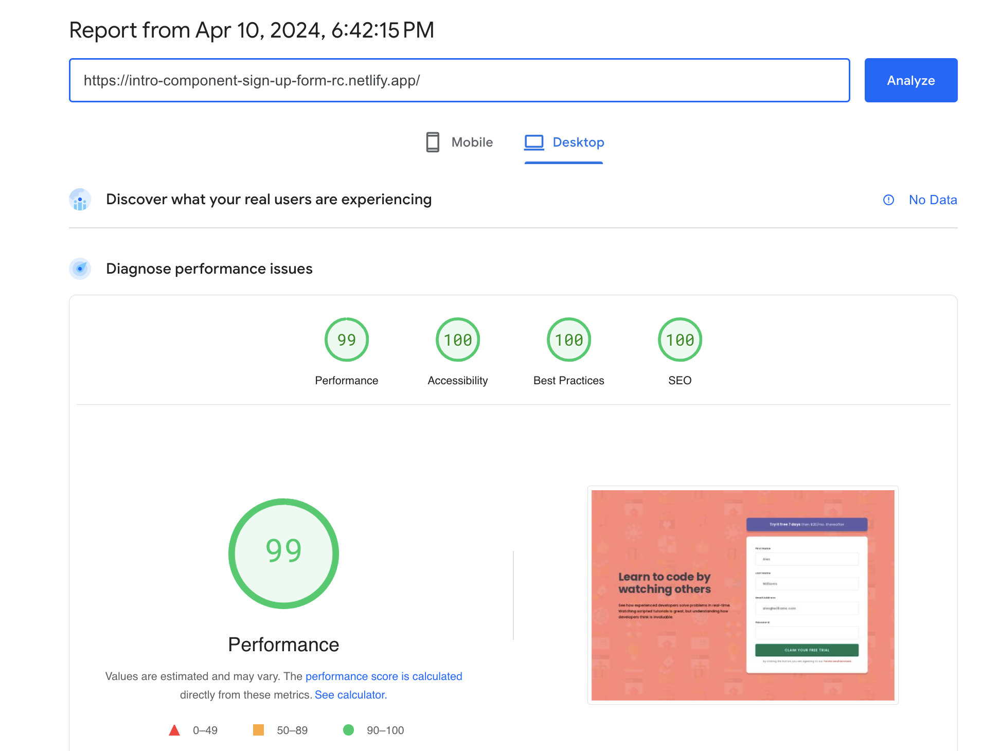

# Frontend Mentor - Intro component with sign up form solution

This is a solution to the [Intro component with sign up form challenge on Frontend Mentor](https://www.frontendmentor.io/challenges/intro-component-with-signup-form-5cf91bd49edda32581d28fd1). Frontend Mentor challenges help you improve your coding skills by building realistic projects.

## Table of contents

- [Overview](#overview)
  - [The challenge](#the-challenge)
  - [Screenshots](#screenshots)
    - [1. Desktop version](#1-desktop-version)
    - [2. Mobile version](#2-mobile-version)
  - [PageSpeed Insights results](#pagespeed-insights-results)
  - [Links](#links)
- [My process](#my-process)
  - [Built with](#built-with)
  - [Tested with](#tested-with)
  - [What I learned](#what-i-learned)
  - [Continued development](#continued-development)
  - [Useful resources](#useful-resources)
- [Author](#author)
- [Acknowledgments](#acknowledgments)

## Overview

### The challenge

Users should be able to:

- View the optimal layout for the site depending on their device's screen size.
- See hover states for all interactive elements on the page.
- Receive an error message when the `form` is submitted if:
  - Any `input` field is empty. The message for this error should say _"[Field Name] cannot be empty"_
  - The email address is not formatted correctly. The message for this error should say _"Looks like this is not an email"_

### Screenshots

##### 1. Desktop version

##### 2. Mobile version

### PageSpeed Insights results

[Mobile version](https://pagespeed.web.dev/analysis/https-intro-component-sign-up-form-rc-netlify-app/lx7n0fty6v?form_factor=mobile)

[Desktop version](https://pagespeed.web.dev/analysis/https-intro-component-sign-up-form-rc-netlify-app/lx7n0fty6v?form_factor=desktop)

### Links

- Solution URL: [Intro component with sign up form Github URL](https://github.com/rupali317/intro-component-sign-up-form)
- Live Site URL: [Intro component with sign up form live URL](https://intro-component-sign-up-form-rc.netlify.app/)

## My process

### Built with

- Semantic HTML5 markup
- CSS custom properties
- Javascript
- Regex expression
- Flexbox
- Mobile-first workflow
- [React](https://reactjs.org/) - JS library
- [Styled Components](https://styled-components.com/) - For styles

### Tested with

- Browsers used for testing: Google Chrome, Firefox, Safari, Brave, Microsoft Edge.
- Devices:
  - (Real) MacBook Pro (15 inch), Samsung Galaxy A33 5G, Samsung Galaxy S20+, iPad Air 2.
  - (Virtual) The mobile and tablet devices mentioned under Chrome's dev console.
- Screen reader: MacOS VoiceOver.

### What I learned

- Scenario where the usage of `background-image` is better than that of `<picture>`. `<picture>` has a better performance but it cannot repeat unlike `background-image`.
- Got more familiar with the essential keyboard shortcut for navigating via VoiceOver.
- Used non-capturing group in regex expression `(?:com|org|cc)` since it does not need to captured. Capturing group is for extracting information from a string. Therefore in my case, I learnt that non-capturing group is more appropriate.

### Continued development

- Improve the performance by monitoring the metrcis from PageSpeed Insights (especially Total Blocking Time).

### Useful resources

- [Screen Reader Basics: VoiceOver -- A11ycasts #07](https://www.youtube.com/watch?v=5R-6WvAihms) - This resource was suggested by Grace Snow. It provided the essential keyboard commands needed to operate the VoiceOver.
- [xmatter's valid email address format](https://help.xmatters.com/ondemand/trial/valid_email_format.htm#:~:text=A%20valid%20email%20address%20consists,com%22%20is%20the%20email%20domain) - It provided me a basis on how to construct my regex expression for the email. I used this as my north star especially since I wanted to create the regex expression from scratch.

## Author

- Website - [Rupali Roy Choudhury](https://www.linkedin.com/in/rupali-rc/)
- Frontend Mentor - [@rupali317](https://www.frontendmentor.io/profile/rupali317)

## Acknowledgments

- A big thanks to Grace Snow for guiding on the proper usage of VoiceOver screen reader and how to improve the accessibility related to the form's error messages.
- I express my gratitude towards my mentor - Deborah for the insightful code review session.
